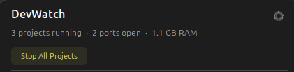
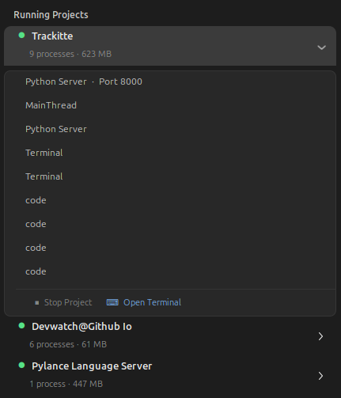
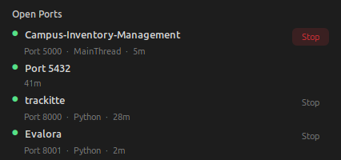
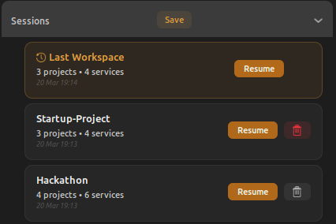
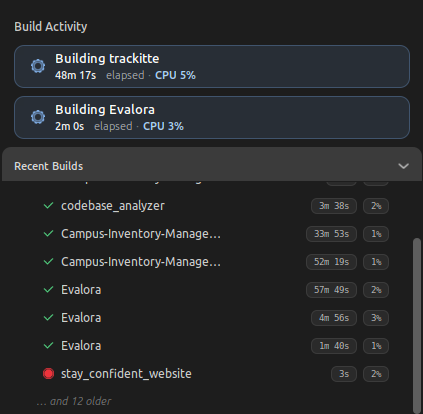

<p align="center">
  <h1 align="center">DevWatch</h1>
  <p align="center"><strong>Your projects. Your ports. Your builds. All in one glance.</strong></p>
  <p align="center">A GNOME Shell extension that turns your Linux desktop into a developer-aware dashboard.</p>
</p>

<p align="center">
  <a href="LICENSE"></a>
  <a href="https://extensions.gnome.org"></a>
  <a href="https://www.linux.org"></a>
</p>

---

## What is DevWatch?

DevWatch is a **GNOME Shell panel extension** that gives Linux developers a live, project-aware dashboard — right in the top panel.

Click **DevWatch** in your panel and instantly see:

- **Running Projects** — which projects are active, how many processes each has, and their memory usage
- **Open Ports** — every listening port, which project owns it, and a one-click Stop button
- **Sessions** — save your entire dev environment and resume it later with one click
- **Build Activity** — live build tracking with elapsed time and CPU usage
- **Problems** — proactive alerts when RAM or CPU spikes on a project

No terminal commands. No window switching. Everything in one dropdown.

---

## How It Works

DevWatch runs in the background and:

1. **Detects your projects** — reads the focused window's working directory and walks up to the nearest `.git` root
2. **Scans processes** — reads `/proc` every 10 seconds and groups processes by project
3. **Monitors ports** — parses `ss -tulnp` output and maps each port back to its owning project
4. **Tracks builds** — detects 35+ build tools (npm, cargo, make, go, etc.) and records duration, peak CPU, and peak RAM
5. **Auto-saves your workspace** — every refresh, DevWatch silently saves a "Last Workspace" snapshot so you can resume after a reboot

Everything runs **locally with zero network access**. No cloud, no telemetry, no elevated privileges.

---

## The DevWatch Panel

When you click the **DevWatch** button in your GNOME panel, the dropdown shows:

### Header Bar



- **Stats line** — live count of projects, ports, and total RAM
- **Stop All Projects** — kills every process in every detected project
- **⚙ Settings** — opens the preferences window

### 🔍 Running Projects

Each project is an expandable card:



- **Service-oriented** — shows "Python Server" instead of raw `python3.12`
- **Stop Project** — kills all processes in that project
- **Open Terminal** — opens `gnome-terminal` at the project's git root

### 🌐 Open Ports



- **Dev ports** highlighted with a colored dot (3000, 5173, 8080, etc.)
- **Project name** shown when a port is linked to a project
- **Stop** button kills the process on that port
- **Runtime** shows how long a port has been open

### 📷 Sessions



- **Save** — name and save the current workspace
- **Last Workspace** — automatically saved every refresh (survives reboots)
- **Resume** — reopens terminals at each saved project root, relaunches services, opens editors
- **Delete** — remove a saved session

### ⚡ Build Activity



- **Live builds** — shows elapsed time and CPU usage for active builds
- **Recent Builds** — collapsible history with duration and peak CPU per build
- Detects: `npm`, `cargo`, `make`, `go build`, `gradle`, `webpack`, `vite`, `tsc`, `gcc`, and 25+ more
- Build history persists across reboots

### ⚠ Problems (conditional)

Only appears when issues are detected:

```
Problems
  ⚠ trackitte  using 3.2 GB RAM
  ⚠ backend  CPU at 92%
```

### 🔴🟡🟢 Status Dot

The colored dot in the panel gives you a health check at a glance:

| Color | Meaning |
|---|---|
| 🟢 Green | Everything healthy |
| 🟡 Yellow | High CPU (>80%) or a build pushing above 90% |
| 🔴 Red | Port conflict detected |

---

## Settings

Access preferences via the ⚙ icon in the dropdown, or run:

```bash
gnome-extensions prefs devwatch@github.io
```

| Page | Setting | Default | Description |
|---|---|---|---|
| **General** | Poll interval | 10s | How often DevWatch scans (5–60 seconds). Changes apply live. |
| **Ports** | Show system ports | Off | Show all listening ports, not just dev ports |
| **Ports** | Port conflict notifications | On | Desktop notification when a dev port is newly occupied |
| **Performance** | Max history rows | 8 | Number of completed builds shown (1–20) |

---

## Keyboard Shortcut

| Shortcut | Action |
|---|---|
| **Super + D** | Toggle the DevWatch dropdown |

---

## Installation

### Requirements

- **GNOME Shell 45–49** (Ubuntu 23.10+, Fedora 39+, Arch with GNOME)
- `git`, `make`, `ss` (usually pre-installed)

### Step 1 — Install Dependencies

**Ubuntu / Debian:**
```bash
sudo apt update && sudo apt install -y git make gettext gnome-shell-extension-prefs
```

**Fedora:**
```bash
sudo dnf install -y git make gettext gnome-extensions-app
```

**Arch Linux:**
```bash
sudo pacman -S --needed git make gettext gnome-extensions
```

### Step 2 — Clone & Install

```bash
git clone https://github.com/Adithya-Balan/DevWatch.git
cd DevWatch
make link
```

### Step 3 — Enable

```bash
gnome-extensions enable devwatch@github.io
```

> **Wayland users:** Log out and log back in if the extension doesn't appear.

### Step 4 — Verify

```bash
gnome-extensions info devwatch@github.io
```

You should see `State: ENABLED` and the **DevWatch** button in your top panel.

---

## Usage Examples

### See what's running

Click **DevWatch** in the panel → browse your running projects and open ports.

### Stop a port

Open dropdown → find the port under **Open Ports** → click **Stop**.

### Save your workspace before leaving

Open dropdown → expand **Sessions** → click **Save** → type a name → click **Confirm**.

### Resume after a reboot

Open dropdown → expand **Sessions** → click **Resume** on "Last Workspace" or any saved session.

### Open a terminal at a project

Expand a project under **Running Projects** → click **⌨ Open Terminal**.

### Monitor a build

Start a build (`npm run build`, `cargo build`, etc.) → it appears under **Build Activity** with live CPU/elapsed time.

---

## Project Structure

```
DevWatch/
├── extension.js            ← Main entry point
├── prefs.js                ← Preferences window (GTK4 / Adwaita)
├── metadata.json           ← Extension identity & GNOME version support
├── stylesheet.css          ← All UI styling (dark theme, amber accents)
├── Makefile                ← Build & development commands
│
├── core/                   ← Logic layer (no UI code)
│   ├── projectDetector.js      Detects projects via window focus + git root
│   ├── processTracker.js       Scans /proc, groups processes by project
│   ├── portMonitor.js          Parses listening ports from ss
│   ├── conflictNotifier.js     Desktop notifications for port conflicts
│   ├── snapshotManager.js      Save / load / restore / delete sessions
│   ├── focusTracker.js         Passive per-poll focus activity logger
│   └── buildDetector.js        Tracks build tools + CPU/RAM + history
│
├── ui/                     ← UI renderers (build panel dropdown sections)
│   ├── healthSummary.js        Header bar with stats + Stop All + Settings
│   ├── alertsSection.js        Problems section (high RAM/CPU alerts)
│   ├── projectSection.js       Running Projects (expandable cards)
│   ├── portSection.js          Open Ports (project-first rows)
│   ├── snapshotSection.js      Sessions (Save / Resume / Delete)
│   ├── perfSection.js          Build Activity (live + history)
│
├── utils/                  ← Shared helpers
│   ├── subprocess.js           Async command runner (Gio.Subprocess)
│   ├── procReader.js           /proc filesystem reader
│   ├── i18n.js                 Translation helpers (gettext)
│   └── focusAggregator.js      Focus summary + timeline aggregation
│
├── schemas/                ← GSettings schema (user preferences)
└── po/                     ← Translation files (i18n ready)
```

---

## Data Storage

All data stays **local on your machine**.

```
~/.local/share/devwatch/
├── snapshots/                  ← Named session snapshots (JSON)
├── _last_workspace_.json       ← Auto-saved workspace (updated every refresh)
├── build_history.json          ← Build performance history
└── focus_log_YYYY-MM-DD.json   ← Passive focus ticks (kept for 7 days)
```

To reset all DevWatch data:
```bash
rm -rf ~/.local/share/devwatch/
```

---

## Makefile Commands

| Command | What It Does |
|---|---|
| `make link` | Compile schemas + symlink into GNOME extension directory |
| `make enable` | Enable the extension |
| `make disable` | Disable the extension |
| `make pack` | Build a distributable `.zip` for extensions.gnome.org |
| `make log` | Tail GNOME Shell logs (see `console.log` output) |
| `make nested` | Launch a safe nested GNOME session for testing |
| `make status` | Show extension info and state |

---

## Contributing

Contributions are welcome! See [CONTRIBUTING.md](CONTRIBUTING.md) for:

- Development setup
- Code style guidelines
- Pull request workflow
- How to add a translation

### Quick Start

```bash
git clone https://github.com/<your-username>/DevWatch.git
cd DevWatch
make link
gnome-extensions enable devwatch@github.io
make log    # watch for errors
```

### Report a Bug

Open a [GitHub Issue](https://github.com/Adithya-Balan/DevWatch/issues) with:
- GNOME Shell version (`gnome-shell --version`)
- Linux distribution
- Steps to reproduce
- Log output (`make log`)

---

## Technical Details

- **Runtime:** GJS (GNOME JavaScript) with ES Modules
- **UI Toolkit:** St (Shell Toolkit) + Clutter actors
- **Async Model:** `Gio.Subprocess` — never blocks the main loop
- **Data Sources:** `/proc` filesystem, `ss` command, `git` CLI
- **Privacy:** 100% local. No network requests, no telemetry, no analytics.

---

## License

[MIT](LICENSE) © 2026 [Adithya Balan](https://github.com/Adithya-Balan)

---

<p align="center">
  <strong>Built for developers who want their desktop to understand their workflow.</strong>
</p>
